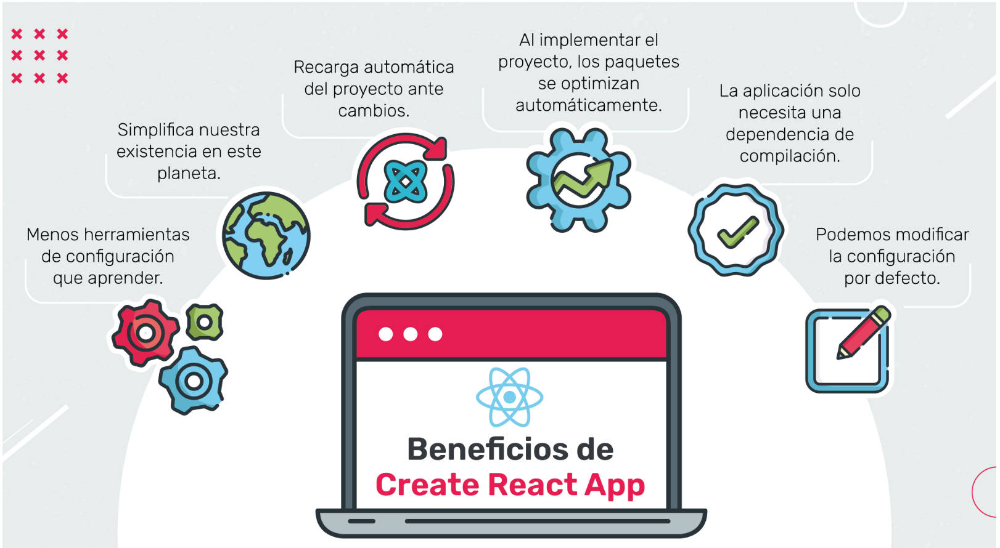
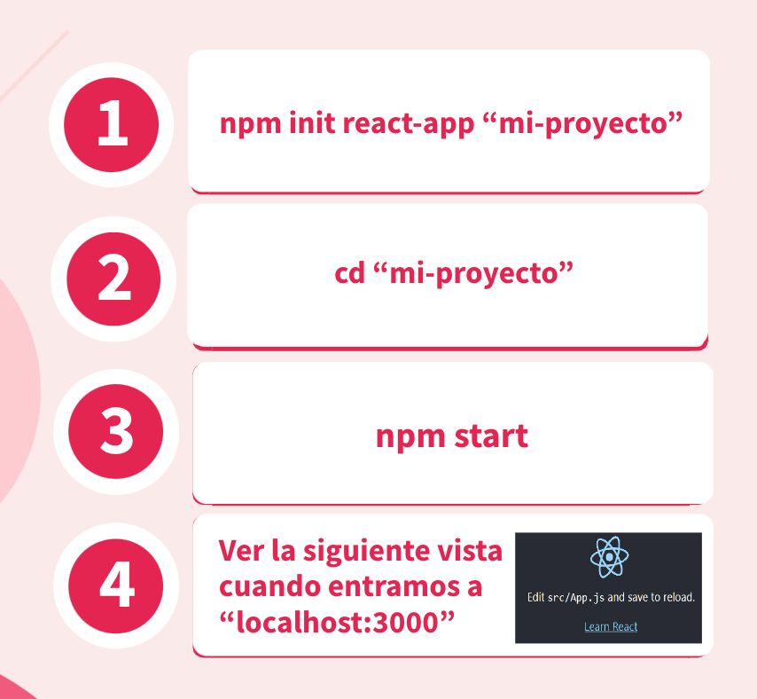
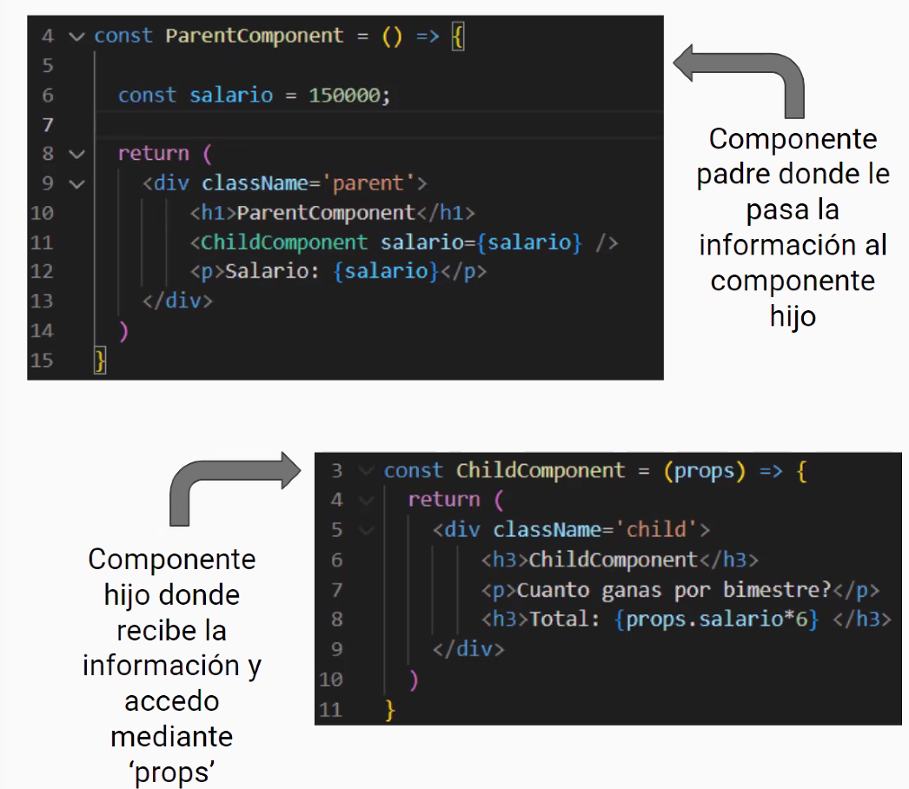
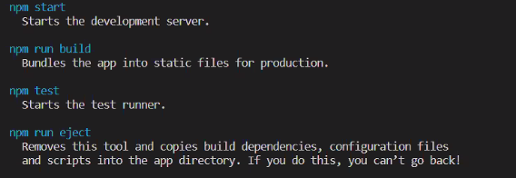
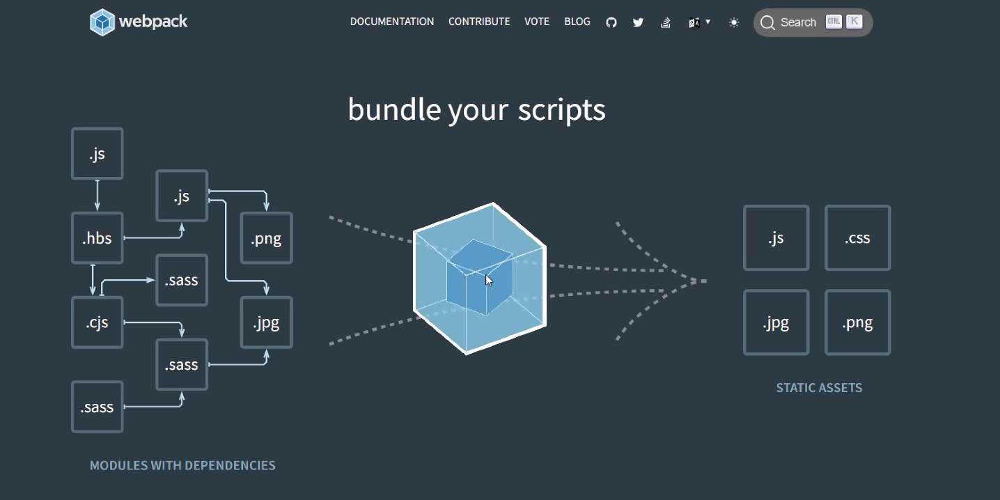
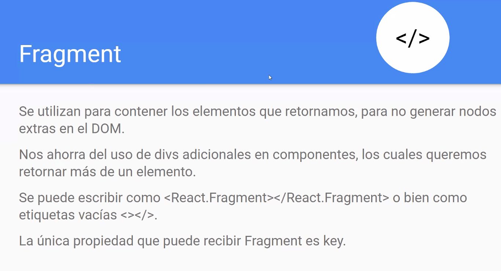
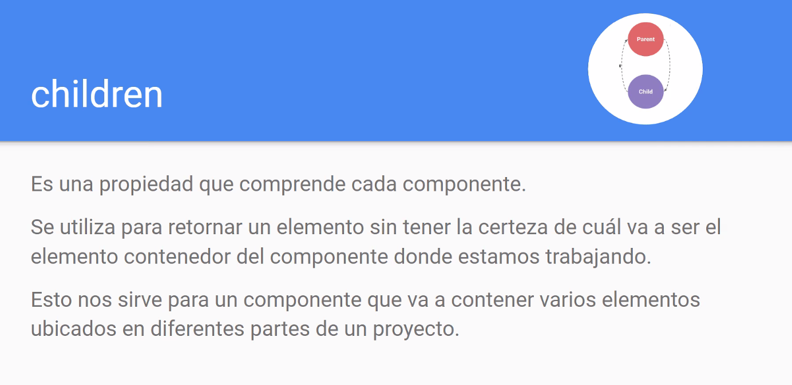
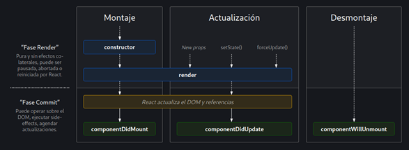

## NOTAS del material

# React 

## Clase 1 
----
Intro - Pq usar React?
- Actualizaciones de estado del lado del navegador (Menos cargas desde el backend y sin recargas en la pagina). Estado ->  son los datos almacenados en la aplicacion, cada vez que alguien modifica algo (sea el backend o el usuario) ocurre un evente, x ej el click, eso hace que cambie el estado de la app. 
- Tecnologia creada en 2011
- Secciones estan pensadas como componentes reutilizables, en vez de etiquetas. 
- Componentes -> son partes autosuficienttes dentro de la UI. 
- La interfaz se creo usando JSX. 
</br>
</br>
Framework vs Library</br>
-> Library: los desarrolladores eligen cuando y donde se usan las funciones. 
-> Framework: el propio framework decide el flow del programa. 
</br>
</br>
React permite pantener una UI de forma:</br>
- Practica
- Rapida 
- Robusta 

</br>
Agregando React a una pagina existente
> ver index.html en carpeta Clases > C1

----

en vivo:
- React es una Library
- Continuamnete de desarrollo
</br>
</br>

-> para importar la libreria de react y de ractDOM en la version 18
```JS
     <script crossorigin src="https://unpkg.com/react@18/umd/react.development.js"></script>
    <script crossorigin src="https://unpkg.com/react-dom@18/umd/react-dom.development.js"></script>
 ```

En reactDOM usamos el metodo render 
```JS
//<div id="root"></div>
    //ReactDom.render(elementoCreado, ElementoDondeIntroduzco)
   React.createElement(
    type,
    [props],
    [...children]
)

```
</br>
La tarea de las mesas de trabajo se encuentra en la capera Clases> C1 en el archivo C1.html 

</br>
</br>

## Clase 2
---
Repaso de JS
- Declaracion de variables :
    ```JS 
    var: estandar. Funciona en varios ambitos o bloques
    let: es una variable que solo funciona dentro del bloque de codigo que se situa.
    const: no modificable 
    ``` 
- Declaracion de funciones:  
    ```JS
    function myFuncion(){}

    ```

- Metodos de document que messirven para react:
    ```JS
    document.querySelector();
    document.querySelectorAll();
    document.getElementById();
    document.getElementByClassName();
    document.getElementBytName();
    document.getElementsByTagName();
    document.addEventListener();
    ```

</br>

BABEL 

Babel, se importa y traduce el JSX a una forma gralmente mas secilla. 

```JS 
<script src="https://unpkg.com/babel-standalone@6/babel.min.js"></script>

 //y abajo el script va a ser de tipo babel
 <script type="text/babel"> </srcipt>
```
Trabajo en mesas, se encuentra en la carpeta C2>mesa5.html

</br>
</br>

## Clase 3 - Integradora 
Revision </br>
Corregimos los trabajos realizados en la mesas el martes.

Mesa de trabajo en la carpeta C3>index.html

</br>
</br>

## Clase 4 
Creando una aplicación con React</br>
</br>


Como se instala React?</br>
</br>

</br>


[LINK --> Pasos a seguir para crear app en react](https://create-react-app.dev/)

----

En vivo: </br>

Que son las props?

- Cumplen la funcion de pasar informacion de un componente a otro. 
- Un componente recibe informacion desde su componente padre y de esta forma, poder utlilzar dicha informacion. 
- Si bien, las props, son inmutables, se pueden volver a gurdar en otra variable y esta misma puede modificarse. 
</br>



-> En cada compnente sea hijo o padre se le pueden pasar props (propiedades).

```JS
    <div id="root"></div>

    const Photo=(props)=>{
        return(
            <section className="photo" class="col-4 d-flex justify-content-center">
                </img>
            </section>
        )
    }

    function App() {     
        return(
            <div>
                <Photo pic="https://es.web.img2.acsta.net/pictures/22/04/18/16/11/4406324.jpg"/>
            </div>        
        )
    }
    ReactDOM.render(<App/>, document.getElementById('root'))
```

En este caso la App al renderizarse, muestra la foto indicadaa en la funcion APP (Componente padre), Photo, el componente hijo, recibe la pops declarada en App. 

Create react APP comandos:


El trabajo realizado en las mesas del dia de la fecha se encuentra en Clases>C4 

</br>
</br>

## Clase 5

Ejemplo de componente funcional:
```JS
    import React from'react';
    import React DOM from'react-dom';
    const MyComponent Functional=()=><h1>Hola mundo de las Funciones/h1;
    ReactDOM.render(
    <My Component Functional/>,
    document.getElementById('root')
    ); 
```

```JS
    import React from'react';
    import ReactDOM from'react-dom';
    class MyComponent Class extends React.Component{
    render(){
        return<h1>Hola mundo de las Clases/h1;
    };
    ReactDOM.render(
    <My Component Class/>,
    document.getElementById('root')
    );
```
</br>
Las props pasan informacion o atributos entre componentes

- Las props son inmutables 
- Las props son recibidas
- Las props facilitan la reutilizacion de componentes
- Son pasadas al componentes hija o hijo cuando este se esta creando. 
- Para un componente hijo las propiedades no cambian despues del render inicial. 
- Facilita la previsibilidad en el manejo de datos de la aplicacion.

----

Clase en vivo </br>
```JS
import ...
require(...)
// son parecidos
// Y hay que exportar al final de APP.js (que seria el main component)
```
El trabajo de las mesas de esta clase se encuentra en la carpeta Clases > C5

</br>
</br>

## Clase 6 - Integradora 
Clase de repaso en vivo</br>

Que es webpack ?</br>
Es un empaquetador d emodulos que se va a encargar de mostrar el proyecto que desarrollamos dentro de un browser.</br>
Va a empaquetar todos los archivos que trabajamos y lo va a convertir en un estatico distribuible 
Se puede configurar un webpack dentro del proyecto de react que creamos.</br>



</br>
Que es Eslint ?</br>
Se encarga de optimizar el codigo que realizamos.</br> 
Advierte sobre ciertos patrones que pueden lanzar errores o que pueden mejorar su sintaxis. 
Tambien se puede configurar con el proposito de poder generar un convenio entre desarrolladores.

</br>
Que es Jest y testing-library ?

Son librerias utilizadas para testear el codigo. 
Si instalamos alguna de estas librerias
(...)
Nos devuelven un log con los errores y pruebas ejecutadas. 

</br>
Fragment</br>


</br>
Children</br>


</br>

La trabajo de la mesa se encuentra en la carpeta Clases> C6

</br>
</br>

## Clase 7

Map </br>
La funcion map de Array(Array.prototipe.map) se usa para crear un nuevo aray con los resultados de llamar a una funcion apllicada sobre cada elemento de un array.</br> Dicho de otra forma, map aplica la funcion que se le indique en cada uno de los elementos del array y devuelve un nuevo array de los resultados. La funcion map nos permite mapear, los elementos de un array en otros elementos par un nuevo array. </br>

Keys </br>
En React la clave key es un atributo especial de tipo sstring que se debe incluir al crear listas de elementos. React lo utiliza para identificar cuales elementos han cambiado, se han agregado o se han eliminado.</br>

Css en componentes</br>


Clase en vivo</br>

 Hacemos repaso de CSS con el profe en 
 -  [Flex-box froggy](https://flexboxfroggy.com/#es)
- Otro juego para practicar: [Grid garden](https://cssgridgarden.com/)


Repaso de css en componentes:</br>
- Inline (estilo en la misma linea del componente dentro de sus tags) se trabaja como su fuese un objeto pero con codigo CSS. 

    ```HTML
    <h1 style={{backgroundColor:'red', }} className='title' >Blog de gatos</h1>
    ``` 
    
- es buena practica apartarlo en un archivo especifico para el estilo.
```JS
//x ej en JS generamos un estilo x component: 
export const title ={
    textAlign:'center';
    color:'#0000';
    fontSize: '3rem';
}
// y desp lo importas como 
import {title} from ".. donde se encentre el archivo";
//tambien se puede aplicar en un CSS e importarlo como 

import styles from './style.css'
```
El trabajo de la mesa se encuentra en Clases>resueltos>C7


</br>
</br>

## Clase 8
Componentes Stateful</br>
Los componentes con estado son aquellos que pueden cambiar su contenido interno a partir de eventos externos. </br>
- Los componentes 'stateful' son aquellos que estan atentos a los eventos que los rodean y saben reaccionar a los mismos.</br>
En funcion de esos eventos, el componente podra cambiar su contenido interno.</br>
Estos componentes ya no seran funciones nativas de JS, sino que trabajamos con un nuevo tipo de dato: una clase. </br>
```JS
import React,{Component} from 'react';
class NombreComponente extends Component{
    render(){
        return(...);
    };
}
export default NombreComponente;
```
Solemos utilizar los componentes stateful cuando esperamos cierta interacción del usuarioy, en baseaeso,queremos que el interior de nuestro
componente cambie. </br> Los componentes stateful son reactivosypor ende el DOM se actualiza cuando es necesario.</br>

State y setState</br>
Solemos utilizar los componentes stateful cuando esperamos cierta interacción del usuarioy,en baseaeso,queremos que el interior de nuestro componente cambie.
Los componentes stateful son reactivos y por ende el DOM se actualiza cuando es necesario. </br>

State</br>
En su momento, dijimos que una de las razones por las cuales React nos
beneficia es la actualización por componentes del DOM.</br>
También, indicamos que los componentes con estado eran reactivosalas
interacciones con el usuarioyque, en baseaeso, se actualizabanono.</br>
Ahora, llegó el momento de fusionar estas dos características de React y empezarausarlas.</br>
Vamos a ver cómo usamos setState para cambiar el estado de nuestros
componentes, ya sea ante eventos de usuario, cambios en el servidoro
cambios en los props.</br>
Veamos cómo se ve esto en el código con un breve ejemplo.</br>

Mini resumen de lo visto hasta ahora en C8:</br>
### Herencia:

La programación orientada a objetos introdujo el concepto de herencia. </br>
En React y, por lo tanto, en JavaScript, existen dos formas de herencia:
- la herencia clásica
- la herencia basada en prototipo.</br>
Esta última ha estado desde la creación misma de JavaScript, pero recién con la incorporación de las clases en ECMAScript 2015 la herencia clásica entróaformar parte de JavaScript.</br>
La herencia basada en clases es simplemente un mecanismo para crear
nuevas clasesapartir de clases existentes.</br>
En JavaScriptyReact, se utiliza la palabra clave extends.Por ejemplo,para crear un nuevo componente de clase en React se utiliza la clase base Component así:
```class App extends React.Component{}```
Ahora nuestra clase App tiene todo lo que tiene la clase Component de
React.</br>

### Especializacion:
La especialización es adaptar una clase para hacerla más afín con nuestras necesidades. Por ejemplo, nuestra clase App tiene lo que heredó de Component, en este sentido, es genérica aún. Pero ahora podemos agregar datos y funciones para especializarse en el trabajo que queremos realizar con la clase App.</br>

### Reutilizacion:
La reutilización es simplemente poder hacer uso de lo que ya tenemos a disposición, en lugar de tener que reescribirlo o copiarlo. En nuestro caso,
al heredar de la clase base de React Component nos libramos de tener que escribir esa funcionalidad nosotros, o de copiarla desde la biblioteca a nuestro código.</br>

### Composicion:
La composición es otra forma de reutilización y puede tener distintas formas: composición de funciones, composición de objetos y composición de clases, pero la idea es la misma: escribir funcionalidad en forma separada para poder combinarlas. Con esto, se logran estructuras menos rígidas porque las relaciones que se forman no son jerarquías del tipo “es un”, sino que son del tipo “usa un”.</br>


</br>
</br>

## Clase 9 - Integradora

Revision y practica</br>

Hacemos un ejercicio de pokedex, se encuenra en la carpeta > Clases > C9
Clonamos un proyecto desde github y realizamos las consignas.

</br>
</br>


## Clase 10 

Ciclo de vida:</br>
Los componentes tienen ciclos de vida, y pasa por varios estadios:
</img>

.. Falta la teoria de ComponentDidMount ...etc + </br>

La tarea de las mesas se encuentra en la carpeta Clases> C10

</br>
</br>

## Clase 11 

Eventos del usuario:</br>
- Se declaran con el prefijo ```on``` </br>
- En el caso de onSubmit, utilizara un manejador de eventos `hanleSubmit` ejemplo: 
```JSX
function handleSubmit(e){
       e.preventDefault();
       console.log("You clicked submit.");
    }
    render{
        return(
           <form onSubmit={handleSubmit}>
                <button type="submit">Submit</button>
           </form>
        );
    }
```
- Las respuestas a un evento de usuario debe funcionar y mostrarse de la forma deseada, tanto para nosotros como para las personas usuarias. </br>

Componentes controlados vs no controlados </br>
- Controlados: llevan un registro de que pasa en un input. ---> los controla REACT! 
- No controlados: igualmente controlado como cualquier elemento insertado en el DOM. ---> los controla el DOM!
- React necesita controlar los inputs para un manejo eficiente de los cambios.


La tarea de la clase se encuentra en la carpeta Clases> C11

</br>
</br>

## Clase 12 - Integradora

</br>
</br>

## Clase 13

</br>
</br>

## Clase 14

</br>
</br>

## Clase 15 --Integradora

</br>
</br>

## Clase 16

</br>
</br>